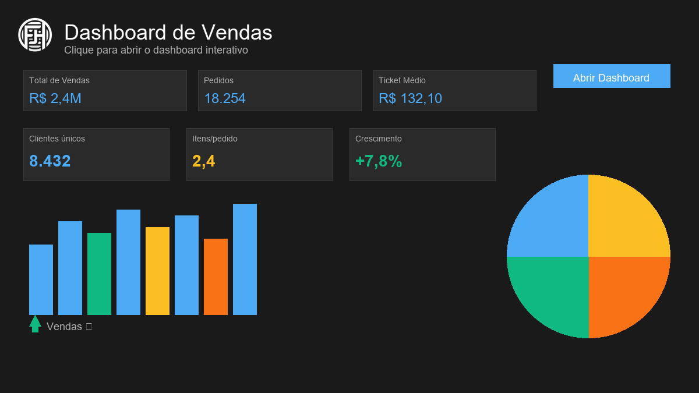

# Análise Financeira com Apresentação Executiva (Sam's Club - Walmart)

[](https://flaviohenriquehb777.github.io/Projeto_3_Financas_com_Apresentacao_Final_em_PPT/dashboard_vendas.html)
[](https://flaviohenriquehb777.github.io/Projeto_3_Financas_com_Apresentacao_Final_em_PPT/)

[p align="center"]
<p align="center">
  <a href="https://flaviohenriquehb777.github.io/Projeto_3_Financas_com_Apresentacao_Final_em_PPT/dashboard_vendas.html?v=2025-11-26" title="Dashboard de Vendas">
    
  </a>
  <a href="https://flaviohenriquehb777.github.io/Projeto_3_Financas_com_Apresentacao_Final_em_PPT/dashboard_analise_ad_hoc.html" title="Dashboard Análise ad hoc">
    
  </a>
  
</p>

Clique em qualquer miniatura acima para abrir o dashboard diretamente no navegador.

[](LICENSE.md)

**Projeto de consultoria financeira para o Sam's Club - Walmart, com o objetivo de gerar insights a partir de dados de vendas e apresentá-los de forma executiva.**

## Sumário
- [Visão Geral do Projeto](#visão-geral-do-projeto)
- [Objetivos da Análise](#objetivos-da-análise)
- [Estrutura do Projeto](#estrutura-do-projeto)
- [Base de Dados](#base-de-dados)
- [Metodologia de Análise](#metodologia-de-análise)
- [Dashboard Interativo](#dashboard-interativo)
- [Resultados Chave e Apresentação](#resultados-chave-e-apresentação)
- [Tecnologias Utilizadas](#tecnologias-utilizadas)
- [Instalação e Uso](#instalação-e-uso)
- [Licença](#licença)
- [Contato](#contato)

## Visão Geral do Projeto:

Este projeto consiste em uma consultoria financeira abrangente para o Sam's Club - Walmart, com foco na análise de dados de vendas para responder a questões de negócio cruciais. A análise detalhada é realizada em um notebook Jupyter, os principais insights são consolidados em uma apresentação executiva formatada para decisão, e agora inclui um **dashboard interativo** para exploração dinâmica dos dados.

## Objetivos da Análise:

A análise financeira foi guiada pelas seguintes perguntas chave, visando fornecer informações acionáveis para a gestão:

1.  **Como foi o desempenho de vendas da empresa no período analisado?**
2.  **Qual foi a categoria de produtos mais vendida?**
3.  **Qual foi o item (produto específico) mais vendido?**

## Estrutura do Projeto:

Este repositório está organizado para facilitar a compreensão e replicação do projeto:

-   dados/:
    -   criando_uma_apresentacao_executiva.csv: A base de dados bruta utilizada para a análise.
-   notebooks/:
    -   Calculos_Financeiros_Empresa.ipynb: O notebook Jupyter que contém toda a análise de dados, desde a importação e tratamento até a geração dos gráficos e cálculos para os insights.
-   ppt/:
    -   Apresentacao_Executiva.pptx: A apresentação em PowerPoint com os resultados e insights consolidados para uma audiência executiva.
-   dashboard_vendas.html: **NOVO** - Dashboard interativo para análise exploratória de dados.
-   README.md: Este arquivo, fornecendo uma visão geral do projeto.
-   LICENSE.md: Arquivo contendo os termos da licença do projeto (MIT).
-   requirements.txt: Lista das bibliotecas Python e suas versões necessárias para executar o notebook.

## Base de Dados:

O projeto utiliza o arquivo criando_uma_apresentacao_executiva.csv, localizado na pasta dados/. Este dataset contém informações detalhadas sobre as vendas, incluindo datas, valores, categorias e nomes de produtos, permitindo uma análise aprofundada do desempenho financeiro.

## Metodologia de Análise:

A análise foi conduzida de forma meticulosa, seguindo os seguintes passos no notebook Calculos_Financeiros_Empresa.ipynb:

1.  **Configuração do Ambiente:** Importação das bibliotecas necessárias e configuração inicial.
2.  **Importação e Visualização da Base:** Carregamento do dataset e uma primeira inspeção dos dados.
3.  **Pré-processamento de Dados:**
    * Filtragem de registros irrelevantes.
    * Agrupamento de dados para sumarização de vendas por categoria, produto, mês e ano.
    * Transformação de tipos de dados para garantir a consistência e permitir operações analíticas.
4.  **Cálculos e Transformações:** Realização de cálculos financeiros para derivar métricas de desempenho.
5.  **Visualização de Dados:** Geração de gráficos (com bibliotecas como Matplotlib e Seaborn) para ilustrar tendências de vendas, desempenho de categorias e identificar os produtos mais vendidos.
6.  **Extração de Insights:** Identificação das respostas para as perguntas chave do projeto, baseadas nas análises e visualizações.

## Dashboards Interativos:

###  **Dashboard de Vendas**

O projeto agora inclui um **dashboard web interativo** (dashboard_vendas.html) que permite uma exploração dinâmica e em tempo real dos dados de vendas.

#### Características Principais:

- **Interface Moderna e Escura**: Design elegante com tema escuro para melhor visualização
- **Métricas em Tempo Real**: 
  - Total de vendas
  - Número de pedidos
  - Ticket médio
  - Clientes únicos
  - Média de itens por pedido
  - Taxa de crescimento

#### Filtros Avançados:
- **Filtros Dinâmicos**: Ano, região, segmento, categoria, modo de envio
- **Seleção de Top N**: Configuração para visualizar top 5, 10, 15 ou 20 produtos
- **Intervalo de Datas**: Filtro por período específico

#### Visualizações Incluídas:
1. **Tendência Temporal**: Gráfico de linhas mostrando evolução das vendas ao longo do tempo
2. **Segmentos de Clientes**: Gráfico de doughnut com distribuição por segmento
3. **Categorias de Produtos**: Gráfico de pizza com participação por categoria
4. **Top Produtos**: Gráfico de barras horizontais com produtos mais vendidos
5. **Vendas por Região**: Gráfico de barras comparativo entre regiões
6. **Modos de Envio**: Gráfico de pizza com distribuição dos modos de envio
7. **Tabela Detalhada**: Visualização tabular com os dados filtrados

#### Funcionalidades de Exportação:
- **Exportação para CSV**: Download dos dados filtrados em formato CSV
- **Exportação para PDF**: Relatório completo em PDF incluindo:
  - Métricas principais
  - Insights automatizados
  - Tabela de dados
  - Imagens de todos os gráficos

#### Como Usar o Dashboard:
1. Abra o arquivo dashboard_vendas.html em qualquer navegador moderno
2. Utilize os filtros no topo para refinar os dados
3. Clique em "Aplicar Filtros" para atualizar as visualizações
4. Use os botões de exportação para gerar relatórios

### Dashboard Análise ad hoc

O projeto também inclui um **dashboard de Análise ad hoc** (`dashboard/dashboard_analise_ad_hoc.html`) com foco em exploração direta e seleção dinâmica entre gráficos.

#### Destaques:
- **Correlação visual entre gráficos**: seleção em um gráfico destaca dados relacionados nos demais.
- **Reset global**: limpar seleção restaura cores, destaques e estados originais.
- **Design consistente**: segue o mesmo tema visual e responsivo do dashboard de vendas.

#### Como Usar:
1. Abra `dashboard_analise_ad_hoc.html` em um navegador moderno.
2. Interaja com os gráficos (clique/hover) para destacar dados relacionados.
3. Use os controles de limpar seleção para retornar ao estado inicial.

### Publicação via GitHub Pages

Como visualizar de forma interativa (sem clonar o repositório):

- Página inicial (landing page): `https://flaviohenriquehb777.github.io/Projeto_3_Financas_com_Apresentacao_Final_em_PPT/`
- Dashboard direto: `https://flaviohenriquehb777.github.io/Projeto_3_Financas_com_Apresentacao_Final_em_PPT/dashboard_vendas.html`
- Dashboard ad hoc: `https://flaviohenriquehb777.github.io/Projeto_3_Financas_com_Apresentacao_Final_em_PPT/dashboard_analise_ad_hoc.html`

Observações:
- A landing page (`dashboard/index.html`, publicada na raiz) tem um botão “Acessar Dashboard”.
- O dashboard usa bibliotecas via CDN (`Chart.js`, `jsPDF`, `html2canvas`, `jspdf-autotable`) e dados embutidos, então roda 100% no navegador.
- Caso o site demore a publicar, aguarde alguns minutos ou verifique o estado do GitHub Pages em “Settings > Pages”.

### Publicação via GitHub Pages

Este site publica o conteúdo da pasta `dashboard` diretamente no branch `gh-pages`.

- Configuração em Pages: “Deploy from a branch” → `gh-pages` em `/(root)`
- Workflow: `.github/workflows/deploy-gh-pages.yml` com `publish_dir: dashboard`
- Após cada push em `main`, o conteúdo de `dashboard/` é enviado para `gh-pages`

URLs de acesso:
- Site (index do dashboard): `https://flaviohenriquehb777.github.io/Projeto_3_Financas_com_Apresentacao_Final_em_PPT/`
- Dashboard direto: `https://flaviohenriquehb777.github.io/Projeto_3_Financas_com_Apresentacao_Final_em_PPT/dashboard_vendas.html`
- Dashboard ad hoc: `https://flaviohenriquehb777.github.io/Projeto_3_Financas_com_Apresentacao_Final_em_PPT/dashboard_analise_ad_hoc.html`

Se o deploy ficar “pendente” ou “rejected”, aprove o ambiente `github-pages` em “Pages → Deployments” e confirme que o Pages está apontando para `gh-pages/(root)`.

### Miniatura do Projeto (Preview 1200×630)

A miniatura apresentada no topo do README usa `dashboard/preview.png` (proporção **1200×630**), gerada automaticamente com a logo integrada, para melhor compatibilidade visual com OpenGraph/Twitter.

Como gerar/atualizar automaticamente:
1. Instale Pillow (se necessário): `pip install Pillow`
2. Execute: `python tools/build/generate_preview.py`
3. O script salva:
   - `dashboard/preview.png` (1200×630, com a logo integrada)
   - `dashboard/favicon.png` e `dashboard/favicon.ico` (favicons)
   - variações `dashboard/favicon-16.png`, `-32`, `-48`, `-64`, `-128`, `-256`, `-512`

Personalização rápida:
- Ajuste cores, textos e fontes em `tools/generate_preview.py`.
- Substitua a imagem em `dashboard/logo_fh.png` para atualizar o branding e regenere a miniatura.

### Metadados e Favicon (Compartilhamento)

As páginas `index.html` (landing) e `dashboard_vendas.html` foram atualizadas com metatags **OpenGraph** e **Twitter Cards** apontando para a **logo** em URL absoluto, garantindo a miniatura correta.

- OpenGraph/Twitter: imagem `dashboard/preview.png` (URL absoluto)
- Favicon: `dashboard/favicon_logo.png` como principal, com `dashboard/favicon.png` e `dashboard/favicon.ico` como fallbacks
- Geração: `tools/build/generate_preview.py` cria todas as imagens automaticamente

## Resultados Chave e Apresentação:

Os resultados detalhados podem ser encontrados no notebook, mas os principais insights foram sintetizados na Apresentacao_Executiva.pptx, disponível na pasta ppt/. Esta apresentação visa comunicar de forma clara e concisa o desempenho de vendas, as categorias e produtos de maior destaque, e outras observações relevantes para a tomada de decisões estratégicas.

## Tecnologias Utilizadas:

-   Python
-   Pandas (para manipulação e análise de dados)
-   Numpy (para operações numéricas)
-   Matplotlib (para visualização de dados)
-   Seaborn (para visualizações estatísticas)
-   Jupyter Notebook / Jupyter Lab
-   Microsoft PowerPoint (para a apresentação executiva)
-   **HTML5, CSS3, JavaScript** (para o dashboard interativo)
-   **Chart.js** (para visualizações gráficas no dashboard)
-   **jsPDF + html2canvas** (para exportação em PDF)

## Instalação e Uso

Para replicar a análise e visualizar a apresentação, siga os passos abaixo:

- **Pré-requisitos**
  - Python 3.8+
  - pip (gerenciador de pacotes do Python)
  - Jupyter Lab ou Jupyter Notebook
  - Visualizador de arquivos `.pptx` (PowerPoint, Google Slides, LibreOffice)
  - Navegador moderno (para o dashboard interativo)

- **Clone o repositório**
  ```bash
  git clone https://github.com/flaviohenriquehb777/Projeto_3_Financas_com_Apresentacao_Final_em_PPT.git
  cd Projeto_3_Financas_com_Apresentacao_Final_em_PPT
  ```

- **Instale as dependências**
  ```bash
  pip install -r requirements.txt
  ```

- **Análise de Dados (Notebook)**
  ```bash
  jupyter lab
  ```
  Abra `notebooks/Calculos_Financeiros_Empresa.ipynb` e execute a análise.

- **Dashboard Interativo (local)**
  ```bash
  # Windows
  start dashboard\dashboard_vendas.html

  # macOS
  open dashboard/dashboard_vendas.html

  # Linux
  xdg-open dashboard/dashboard_vendas.html
  ```

- **Preview local rápido (opcional)**
  ```bash
  # Servir a raiz do projeto
  python -m http.server 8000
  # ou apenas a pasta dashboard
  cd dashboard
  python -m http.server 8000
  ```

- **Apresentação Executiva**
  Abra `ppt/Apresentacao_Executiva.pptx` para revisar a apresentação executiva.

## Histórico do projeto (março/2023)

Este projeto foi concluído em março de 2023 e permanece arquivado para fins de portfólio e demonstração. Recomenda-se manter o histórico de commits consistente com esse período, evitando scripts de reescrita de datas no repositório público.

## Licença:

Este projeto está licenciado sob a Licença MIT. Para mais detalhes, consulte o arquivo [LICENSE.md](LICENSE.md) na raiz do repositório.

## Contato:

Se tiver alguma dúvida, sugestão ou quiser colaborar, sinta-se à vontade para entrar em contato:
-   **Nome:** Flávio Henrique Barbosa
-   **LinkedIn:** [Flávio Henrique Barbosa | LinkedIn](https://www.linkedin.com/in/fl%C3%A1vio-henrique-barbosa-38465938)
-   **Email:** flaviohenriquehb777@outlook.com
